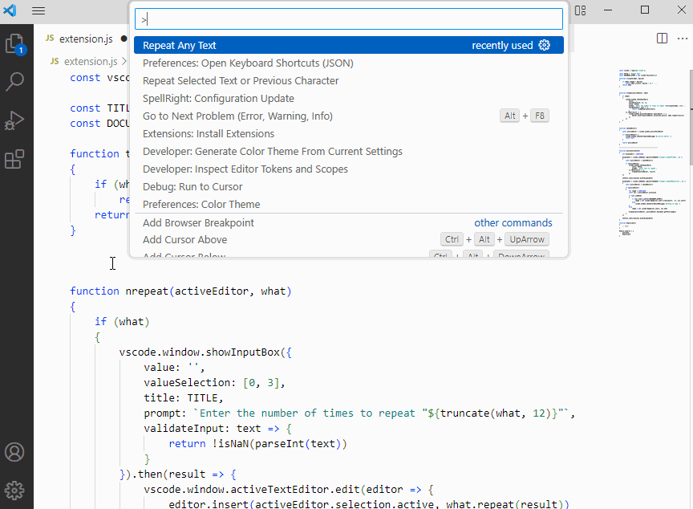

# nrepeat

Similar to Emacs' "repeat" command (ESC<number><character>RET).

## Features

- __Repeat Any Text__: Prompts user for text, then a number(N), and repeats the text N times at the current cursor position

- __Repeat Selected Text or Previous Character__: Same as above, but repeats the currently selected text, or the previous character instead of prompting.

## Requirements

## Extension Settings

TODO

## Known Issues

## Release Notes

### 0.1.0
- Added the handling of multi-selections
- Added setting for what to do after repeating the current selection (nrepeat.selectionAfterRepeat ["keep", "before", "after"])

### 0.0.1
Initial release
